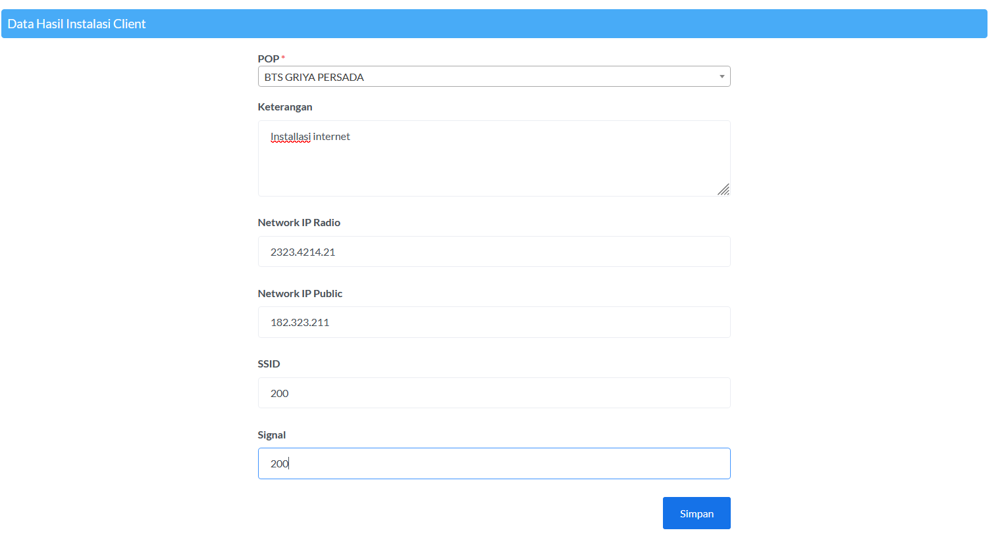

# Installasi

 (1) (1).png>)

## Tambah Data

### Data Teknis

.png>)

Inputkan data teknis yang sesuai

### Data Client

.png>)

Pilih data client yang sesuai

### Data Hasil Installasi Client

Inputkan data hasil installasi yang telah dilakukan, lalu simpan
